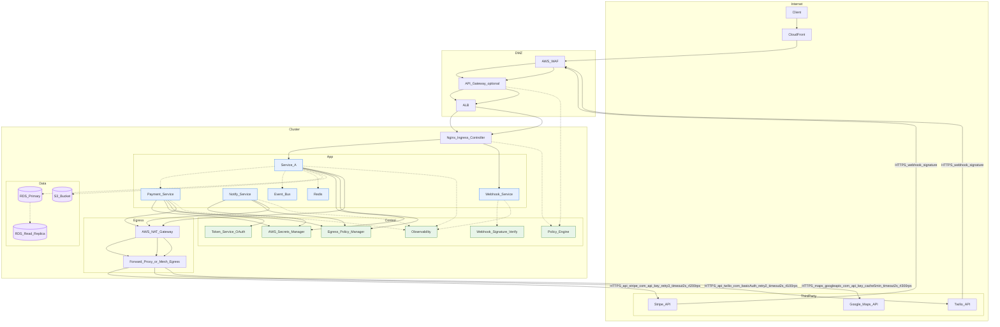

# 架构图中的东西南北流量

这张图的核心意图是用一套可审计、可演进的视角，完整表达单区域云原生 K8s 系统的关键流量路径、边界与控制点，特别强调南北流量、东西流量、第三方出站与 Webhook 回流的端到端治理。

可以看到明确的信任边界与入口栈：Internet → CDN → WAF → API Gateway（可选） → ALB → Ingress → 入口服务，形成南北主路径，便于接入层的鉴权、限流、缓存与安全策略落点。体系化的东西流量表达：在集群内以虚线标示服务间调用、异步队列、缓存与数据库读写/复制，突出内部横向通信对延迟与容量的影响。可控的第三方出站链路：业务服务经 Secrets 管理、Token 服务、Egress 策略白名单后，统一走 NAT/代理访问外部（Stripe/Twilio/Google Maps），并在链路标签中体现超时、重试、限流等可靠性约束。安全的 Webhook 回调通道：第三方回调统一经 WAF → API Gateway → ALB → Ingress → 专职 Webhook 服务，并在服务内做签名校验、重放防护与幂等处理，对外开放面与业务面分流，降低风险。一致的可观测与治理：所有关键服务与入口组件接入 O11y（日志/指标/追踪），策略落在 Policy Engine，为容量规划、SLO 追踪与审计留有统一出口。这张图想要传达的设计约束
所有进入系统的南北流量必须跨越可核验的安全与接入层；所有离开系统的出站调用必须受目的域名/端口白名单与速率限制控制。内部东西流量不仅要画出来，还要区分同步/异步、缓存/读写/复制，便于评审延迟预算和扩缩容策略。第三方依赖需“内外分离”：出站与回调分别建模、分别限流、分别观测，避免耦合与放大故障。凭据与令牌“代码零信任”：通过 Secrets 管理与 Token 服务动态获取与续期，不在代码或配置中长驻明文。用于评审/落地的关键点
信任边界清晰：Internet、DMZ、Cluster 三层边界贯穿了所有南北/回调路径。可靠性策略上图可查：链路标签包含 timeout/retry/rate-limit 的默认假设，可作为 SLO/SLA 的起点。故障与降级路线明确：异步队列、缓存、只读副本与 CDC 复制路径已标注，利于讨论背压与降级手段。可扩展性：可替换 CDN/WAF/LB/Ingress/第三方供应商；可按需引入 Service Mesh/Egress Gateway 而不破坏主拓扑。

